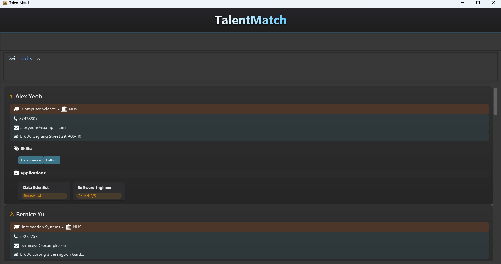
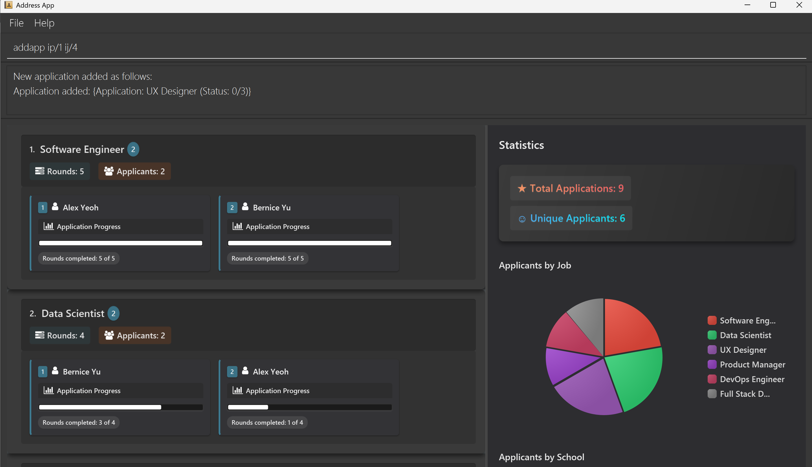
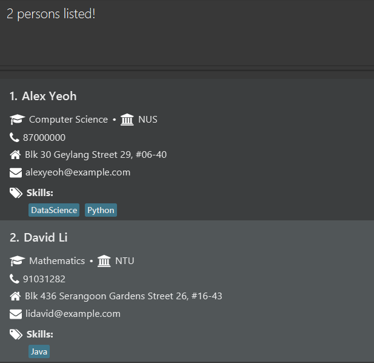
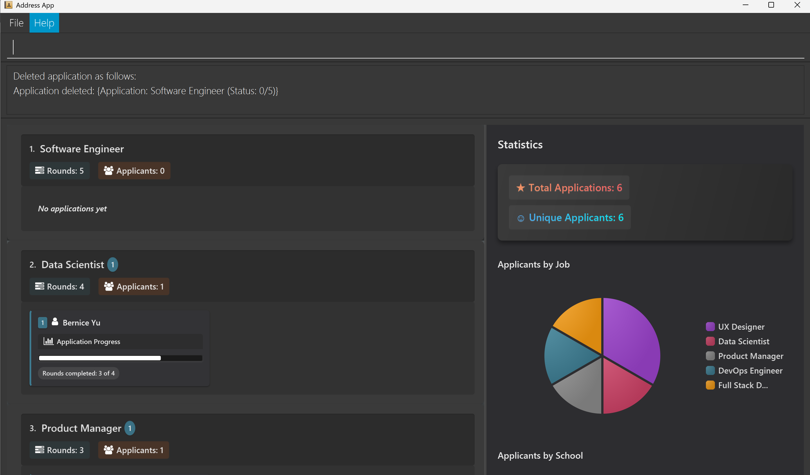
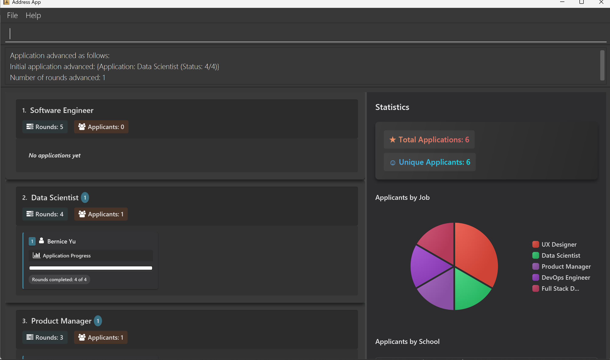
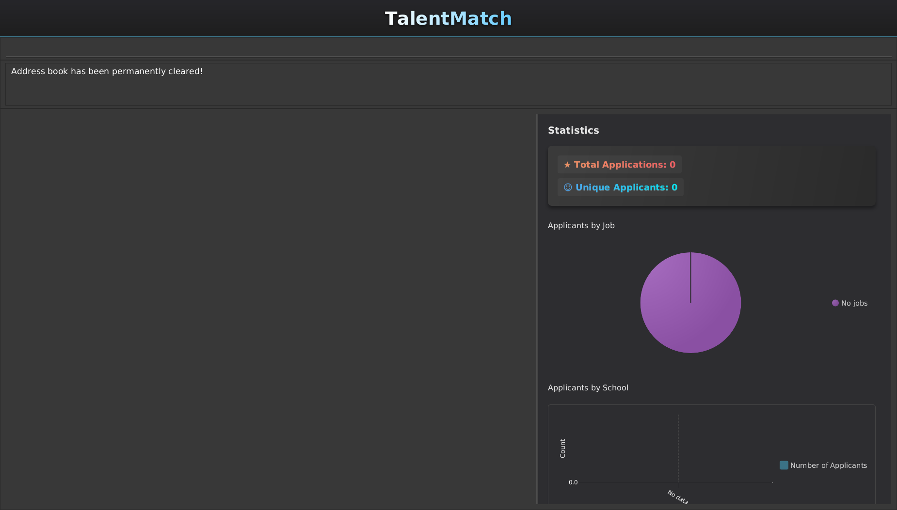

# TalentMatch User Guide

## 🚀 **Revolutionize Your Recruitment Process**

**TalentMatch** is the ultimate **power tool for HR recruiters** in Singapore SMEs who are drowning in internship applications from local universities and need a lifeline. Say goodbye to spreadsheet nightmares and scattered emails!

### 💪 **Built for Busy HR Professionals Like You**

Are you tired of:
* Losing track of promising candidates?
* Forgetting which round of interviews applicants are in?
* Struggling to match the right skills to the right positions?
* Wasting hours on administrative busywork instead of finding your next star intern?

**TalentMatch** combines lightning-fast command-line efficiency with intuitive visuals to give you **complete control** over your recruitment pipeline. Our SME-focused solution lets you manage your entire internship program from a single dashboard.

### ⚡ **Work at the Speed of Thought**

With TalentMatch's CLI interface, you can:
* **Process applications 3x faster** than traditional methods
* **Track candidate progress** across multiple interview rounds
* **Visualize your talent pipeline** with powerful stats and charts
* **Never lose an applicant's details** again with automatic data organization

The more you type, the more time you save. Master our simple commands and watch your productivity soar!

<!-- * Table of Contents -->
<page-nav-print />

--------------------------------------------------------------------------------------------------------------------

## Quick start

1. Ensure you have Java `17` or above installed in your Computer.<br>
   **Mac users:** Ensure you have the precise JDK version prescribed [here](https://se-education.org/guides/tutorials/javaInstallationMac.html).

1. Download the latest `.jar` file from [here](https://github.com/AY2425S2-CS2103T-T08-4/tp/releases).

1. Copy the file to the folder you want to use as the _home folder_ for your AddressBook.

1. Open a command terminal, `cd` into the folder you put the jar file in, and use the `java -jar TalentMatch.jar` command to run the application.<br>
   A GUI similar to the below should appear in a few seconds. Note how the app contains some sample data.<br>
   

1. Type the command in the command box and press Enter to execute it. e.g. typing **`help`** and pressing Enter will open the help window.<br>
   Some example commands you can try:

  * `listjob` : Lists all job entries.

  * `addjob jt/Software Developer jr/3 k/JavaScript`: Adds a job titled `Software Developer` to TalentMatch.

  * `deljob 3` : Deletes the 3rd job shown in the current list.

  * `clear` : Deletes all entries.

  * `exit` : Exits the app.

1. Refer to the [Features](#features) below for details of each command.

--------------------------------------------------------------------------------------------------------------------

## Features

### Command History

TalentMatch supports remembering command history, allowing you to be able to navigate through your past inputs and reduce the need to type out every command from scratch!<br>
Simply use the up and down arrow keys after clicking on the command box text input area and navigate through your past inputs like how you would in terminal.

<box type="info" seamless>

**Notes about the command format:**<br>

* Words in `UPPER_CASE` are the parameters to be supplied by you.<br>
  e.g. in `add n/NAME`, `NAME` is a parameter which can be used as `add n/John Doe`.

* Items in square brackets are optional.<br>
  e.g `n/NAME [k/SKILL]` can be used as `n/John Doe k/Python` or as `n/John Doe`.

* Items with `…`​ after them can be used multiple times including zero times.<br>
  e.g. `[k/SKILL]…​` can be used as ` ` (i.e. 0 times), `k/Python`, `k/Java k/Python` etc.

* Parameters can be in any order.<br>
  e.g. if the command specifies `n/NAME p/PHONE_NUMBER`, `p/PHONE_NUMBER n/NAME` is also acceptable.

* All prefixes and commands used in TalentMatch are case-sensitive.<br>
  e.g. if the command specifies `n/NAME p/PHONE_NUMBER`, `N/NAME P/PHONE_NUMBER` is not acceptable.
  e.g. if the command specifies `addjob jt/JOB_TITLE`, `ADDJOB JT/JOB_TITLE` is not acceptable.

* Extraneous parameters for commands that do not take in parameters (such as `help`, `list`, `exit` and `clear`) will be ignored.<br>
  e.g. if the command specifies `help 123`, it will be interpreted as `help`.

* Job commands should be called only in job view while person commands should be called only in person view. This is to ensure you can see real time updates in response to their queries.

* If you are using a PDF version of this document, be careful when copying and pasting commands that span multiple lines as space characters surrounding line-breaks may be omitted when copied over to the application.
</box>


### Viewing help : `help`

Shows a message explaning how to access the help page.


Format: `help`

### Switching views : `switch`

Switches the view of GUI from job view to person view.

Please note the differences in job view and person view as the commands available are different.

**Job View:**


**Person View:**



Format: `switch`

### Adding a person/job/application

#### Adding a person: `add`
Adds a person to TalentMatch.

Format: `add n/NAME s/SCHOOL d/DEGREE p/PHONE_NUMBER e/EMAIL a/ADDRESS [k/SKILL]…​`

<box type="tip" seamless>

**Tip:** A person can have any number of skills (including 0)
</box>

Examples:
* `add n/John Doe s/NUS d/Computer Science p/98765432 e/johnd@example.com a/John street, block 123, #01-01`
* `add n/Betsy Crowe s/NTU d/Civil Engineering t/friend e/betsycrowe@example.com a/Newgate Prison p/1234567 k/python`

---

#### Adding a job: `addjob`
Adds a job to TalentMatch

Format: `addjob jt/JOB_TITLE jr/INTERVIEW_ROUNDS k/SKILL`

Examples:
* `addjob jt/Software Engineering jr/3 k/python`

---

#### Adding an application: `addapp`
Adds an application to TalentMatch

Format: `addapp ip/PERSON_INDEX ij/JOB_INDEX`

<box type="tip" seamless>

**Tips:**
* All applications start from the 0th round each time.
* The person index can be obtained by switching to person view in TalentMatch.
* The job index can be obtained by switching to job view in TalentMatch.
</box>

<box type="warning" seamless>

**Constraints:**
* Person and job indices must be valid positive integers existing in the respective views.
TalentMatch flags it out with this exception message:
    * ```Invalid command format!
      addapp: Adds an application to the address book.
      Parameters: ip/PERSON INDEX IN PERSON VIEW ij/JOB INDEX IN JOB VIEW
      Example: addapp ip/1 ij/2```
* No existing applications must be present.
TalentMatch flags duplicate applications for the same applicant and job out with this exception message:
    * `This application already exists in the address book Try using delapp instead!`
</box>

Example of a successful command alongside graphical depiction:
* `addapp ip/1 ij/4`
* 


### Listing all persons/jobs

#### Listing all persons: `list`

Shows a list of all persons in TalentMatch.

Format: `list`

---

#### Listing all jobs: `listjob`

Shows a list of all jobs in TalentMatch.

Format: `listjob`

### Editing a person/job

#### Editing a person: `edit`

Edits an existing person in TalentMatch.

Format: `edit INDEX [n/NAME] [s/SCHOOL] [d/DEGREE] [p/PHONE] [e/EMAIL] [a/ADDRESS] [k/SKILL]…​`

* Edits the person at the specified `INDEX`. The index refers to the index number shown in the displayed person list. The index **must be a positive integer** 1, 2, 3, …​
* At least one of the optional fields must be provided.
* Existing values will be updated to the input values.
* When editing skills, the existing skills of the person will be removed i.e adding of skills is not cumulative.
* You can remove all the person's skills by typing `k/` without
    specifying any skills after it.

Examples:
*  `edit 1 p/91234567 e/johndoe@example.com` Edits the phone number and email address of the 1st person to be `91234567` and `johndoe@example.com` respectively.
*  `edit 2 n/Betsy Crower k/` Edits the name of the 2nd person to be `Betsy Crower` and clears all existing skills.

---

#### Editing a job: `editjob`

Edits an existing job in TalentMatch.

Format: `editjob INDEX [jt/JOB_TITLE] [jr/INTERVIEW_ROUNDS] [k/SKILL]`

* Edits the job at the specified `INDEX`. The index refers to the index number shown in the displayed job list. The index **must be a positive integer** 1, 2, 3, …​
* At least one of the optional fields must be provided.
* Existing values will be updated to the input values.
* When editing job skills, the existing skills of the person will be removed i.e adding of skills is not cumulative.
* You can remove all the job's skills by typing `k/` without
  specifying any skills after it.

Examples:
*  `editjob 7 jt/Software Engineering jr/3 k/`

### Locating persons/jobs/applications:

#### Locating persons: `find`

Finds persons whose details contain any of the given keywords.

Format: `find KEYWORD [MORE_KEYWORDS]`

* The search is case-insensitive. e.g `hans` will match `Hans`
* The order of the keywords does not matter. e.g. `Hans Bo` will match `Bo Hans`
* Only full words will be matched e.g. `Han` will not match `Hans`
* Persons matching at least one keyword will be returned (i.e. `OR` search).
  e.g. `Hans Bo` will return `Hans Gruber`, `Bo Yang`

Examples:
* `find John` returns `john` and `John Doe`
* `find alex david` returns `Alex Yeoh`, `David Li`<br>
  

---

#### Locating jobs: `findjob`

Finds jobs whose details contain any of the given keywords.

Format: `findjob KEYWORD [MORE_KEYWORDS]`

* The search is case-insensitive. e.g `software` will match `Software`
* The order of the keywords does not matter. e.g. `Engineering Software` will match `Software Engineering`
* Only full words will be matched e.g. `Engi` will not match `Engineer`
* Jobs matching at least one keyword will be returned (i.e. `OR` search).
  e.g. `Engineer` will return `Software Engineer`, `AI Engineer`

Examples:
* `findjob Software` returns `Software Engineering`

---

#### Locating application: `findapp`

Finds application by job index and application status in job view.

Format: `findapp ij/JOB INDEX as/APPLICATION STATUS`

<box type="tip" seamless>

**Tip:**
* Both the job index and application status can be retrieved from the job view alone.
* The application status is mandatory but the job index is optional. Specify one for a more general search!
* </box>

<box type="warning" seamless>

**Constraints:**
* Job indices and application status must be valid positive integers existing in the respective views.
TalentMatch flags it out with this exception message:
    * ```Invalid command format!
      findapp: Filters the list to show only applications with the specified status in job view.
      Parameters: ij/ OPTIONAL JOB INDEX IN JOB VIEW as/ROUNDS
      Example: findappij/ 1 as/ 2```
* The desired application must already exist in TalentMatch. TalentMatch cannot find a non-existent application!
</box>
Example of a successful command alongside graphical depiction:
* `findapp as/2`
* 

### Deleting a person/job/application

#### Deleting a person: `del`

Deletes the specified person from TalentMatch.

Format: `del INDEX`

* Deletes the person at the specified `INDEX`.
* The index refers to the index number shown in the displayed person list.
* The index **must be a positive integer** 1, 2, 3, …​
* This command is only available in person view.

Examples:
* `list` followed by `del 2` deletes the 2nd person in TalentMatch.
* `find Betsy` followed by `del 1` deletes the 1st person in the results of the `find` command.

---

#### Deleting a job: `deljob`

Deletes the specified job from TalentMatch.

Format: `deljob INDEX`

* Deletes the job at the specified `INDEX`.
* The index refers to the index number shown in the displayed job list.
* The index **must be a positive integer** 1, 2, 3, …​
* This command is only available in job view.

Examples:
* `listjob` followed by `deljob 2` deletes the 2nd job in TalentMatch.
* `findjob Software Engineering` followed by `deljob 1` deletes the 1st job in the results of the `find` command.

---

#### Deleting an application: `delapp`

Deletes the specified application from TalentMatch.

Format: `delapp ij/JOB_INDEX ia/APPLICATION_INDEX`

* Deletes the application with the specified job index and the application index in the corresponding `JobCard` in job view.

<box type="tip" seamless>
**Tip:**
* Both the job and application-by-job indices can be obtained from the job view alone.
</box>

<box type="warning" seamless>

**Constraints:**
* HR recruiters must toggle to the job view, if not already in this view, to delete an application.
TalentMatch flags it out with this exception message:
    * `This command is only available in job view. Please switch to job view first using 'switchview' command.`
* Job and application-by-job indices must be valid positive integers existing in job view.
TalentMatch flags it out with this exception message:
    * ```Invalid command format!
      delapp: Deletes an application from the address book.
      Parameters: ij/<JOB_INDEX> ia/<APPLICATION_INDEX>
      Example: delapp ij/1 ia/2```
* A unique existing application must be present.
TalentMatch flags deleting non-existent out applications with this exception message:
    * `This application does not exist in the address book. Try using addapp to add an application first!`
</box>

Example of a successful command alongside graphical depiction:
* `delapp ip/1 ij/4`
* 

Format: `delapp ij/JOB_INDEX ia/APPLICATION_INDEX`

* Deletes the application at the specified `APPLICATION_INDEX` for the job at the specified `JOB_INDEX`.
* Both indices refer to the index numbers shown in the respective displayed lists.
* Both indices **must be positive integers** 1, 2, 3, …​
* This command is only available in job view.

Examples:
* `delapp ij/1 ia/2` deletes the 2nd application for the 1st job.

### Advancing applications: `adv`

Advances an application to the next round of interview

<box type="tip" seamless>
* All applications are advanced by exactly 1 round each time.
* HR recruiters should exercise discretion in advancing an application as it signifies that the applicant has not only
gone for the round, but also passed it! Therefore, an applicant who has reached the final round of an application will
be deemed to have received a job offer. Congratulations!
* HR recruiters should exercise discretion in advancing an application of any applicant who has reached the final round
of another application, as this would otherwise imply the applicant has more than 1 offers for this company!
</box>

<box type="warning" seamless>

**Constraints:**
* HR recruiters must toggle to the job view, if not already in this view, to advance an application.
TalentMatch flags it out with this exception message:
    * `This command is only available in job view. Please switch to job view first using 'switchview' command.`
* Job and application-by-job indices must be valid positive integers existing in job view.
TalentMatch flags it out with this exception message:
    * ```Invalid command format!
      advapp: Advances an application in the address book.
      Parameters: ij/<JOB_INDEX> ia/<APPLICATION_INDEX>
      Example: advapp ij/1 ia/2```
* A unique existing application must be present.
TalentMatch flags advancing non-existent applications out with this exception message:
    * `This application does not exist in the address book. Try using addapp to add an application first!`
</box>

Format: `adv ij/JOB_INDEX ia/APPLICATION_INDEX`

* Advances the application at the specified `APPLICATION_INDEX` for the job at the specified `JOB_INDEX` by one round.
* Both indices refer to the index numbers shown in the respective displayed lists.
* Both indices **must be positive integers** 1, 2, 3, …​
* This command is only available in job view.

Example of a successful command alongside graphical depiction:
* `advapp ip/1 ij/4`
* 

Examples:
* `adv ij/1 ia/2` advances the 2nd application for the 1st job by one round.

### Viewing job details: `viewjob`

Displays detailed information about a specific job including its title, number of applicants, distribution of applicants across different interview rounds, and required skills.

Format: `viewjob INDEX`

Displays a sidebar that shows the job title abd the number of applicants for that job. It also shows the distribution of applicants across different interview rounds in a bar chart, and the skills required for the job.


* Shows detailed information of the job at the specified `INDEX`.
* The index refers to the index number shown in the displayed job list.
* The index **must be a natural number** 1, 2, 3, …​
* This command is only available in job view.

Expected Output:


Examples:
* `listjob` followed by `viewjob 2` displays detailed information of the 2nd job in TalentMatch.
* `viewjob 1` shows detailed information about the first job in the current list.
* `viewjob 10` will return a NOT_FOUND_MESSAGE if there are no jobs at index 10.
* `viewjob 0` will return a INVALID_COMMAND_MESSAGE as the index must be a natural number.

### Viewing person details from job application: `viewperson`

Shows detailed information about a person from a specific job application.

Shows a sidebar that shows the applicant's name, school, degree, phone number, email, address, and skills. It also shows the application status of the applicant for the job through a progress bar.

Format: `viewperson ij/JOB_INDEX ia/APPLICATION_INDEX`

* Shows detailed information of the person associated with the application at the specified `APPLICATION_INDEX` for the job at the specified `JOB_INDEX`.
* Both indices refer to the index numbers shown in the respective displayed lists.
* Both indices **must be natural numbers** 1, 2, 3, …​
* This command is only available in job view.

Expected Output:


Examples:
* `viewperson ij/1 ia/1` in job view will generate a sidebar with detailed information of the applicant associated with the 1st application for the 1st job (if it exists).
* `viewjob 1` followed by `viewperson ij/1 ia/2` displays detailed information of the applicant associated with the 2nd application for the 1st job.
* `viewperson ij/1 ia/2` will return a NOT_FOUND_MESSAGE if there are no applications at index 2 for the job at index 1.
* `viewperson ij/1 ia/0` will return a INVALID_COMMAND_MESSAGE as the application index must be a natural number.

### Clearing all entries : `clear`

Clears all person entries from TalentMatch, removing both applications, jobs and persons.

Format: `clear`

Expected Output:



### Exiting the program : `exit`

Exits the program.

Format: `exit`

### Saving the data

TalentMatch data are saved in the hard disk automatically after any command that changes the data. There is no need to save manually.

### Editing the data file

TalentMatch stores data in two separate JSON files:
* `[JAR file location]/data/addressbook.json` - Contains all person and job data
* `[JAR file location]/data/applicationbook.json` - Contains all application data linking persons to jobs

Advanced users can update data directly by editing these files, but caution is advised.

<box type="warning" seamless>

**Caution:**
If your changes to the data files make their format invalid, TalentMatch will handle it as follows:

1. If you correctly edit the files and maintain valid format:
   * TalentMatch will load your edited data on next startup
   * All relationships between persons, jobs, and applications will be preserved
   * Your changes will be immediately reflected in the UI

2. If the address book file is invalid or missing:
   * TalentMatch will load sample data for both persons/jobs and applications
   * A warning will be logged, but the application will still start

3. If only the applications file is invalid or missing:
   * TalentMatch will keep the existing persons/jobs data
   * It will create a new, empty applications manager
   * This means all links between persons and jobs will be lost

4. If both files are valid but contain inconsistencies:
   * Applications referring to non-existent persons or jobs may cause unexpected behavior

It is strongly recommended to:
* Back up both data files before editing them
* Keep the file format and data consistent across both files
* Restart the application after making direct edits to verify your changes
</box>

--------------------------------------------------------------------------------------------------------------------

## FAQ

**Q**: How do I transfer my data to another Computer?<br>
**A**: Install the app in the other computer and overwrite the empty data file it creates with the file that contains the data of your previous AddressBook home folder.

--------------------------------------------------------------------------------------------------------------------

## Known issues

### UI Issues
1. **Multiple Window Usage:** When using multiple screens, if you move the application to a secondary screen, and later switch to using only the primary screen, the GUI will open off-screen. The remedy is to delete the `preferences.json` file created by the application before running the application again.
2. **Minimising the Help Window:** If you minimize the Help Window and then run the `help` command (or use the `Help` menu, or the keyboard shortcut `F1`) again, the original Help Window will remain minimized, and no new Help Window will appear. The remedy is to manually restore the minimized Help Window.
3. **Text Truncation in Display:** Long text entries may be truncated with "..." when the application window isn't wide enough. You may not be able to see the complete information for some fields.
4. **Viewport Issues:** Parts of the application may be cut off at smaller window sizes, including the default size at first startup.
5. **Oversized Messages:** Some success and error messages may be too long to read easily in the current application.

### Data Storage Issues
6. **Storage File Synchronization:** The application generates two storage files: applicationsmanager.json and addressbook.json. Both files contain information related to persons and jobs. If you make changes to persons or jobs in one file, you MUST replicate these changes in the other file. Failure to synchronize these files will result in data mismatches when the application loads, leading to undefined application behavior.
7. **Command Syntax Sensitivity:** Any non-adherence to the case sensitivity and input validation rules given in the command descriptions may cause unexpected errors. You should read through and follow these case sensitivity and input validation rules carefully.
8. **Multiple Instance Conflict:** Running multiple instances of the application simultaneously can corrupt your data files. You should only run one instance of TalentMatch at a time. Close any existing instance before opening a new one.

--------------------------------------------------------------------------------------------------------------------

## Command summary

Action     | Format, Examples
-----------|----------------------------------------------------------------------------------------------------------------------------------------------------------------------
**Add**    | `add n/NAME s/SCHOOL d/DEGREE p/PHONE_NUMBER e/EMAIL a/ADDRESS [k/SKILL]…​` <br> e.g., `add n/James Ho s/NUS d/Physics p/22224444 e/jamesho@example.com a/123, Clementi Rd, 1234665 k/python k/java`
**AddJob** | `addjob jt/JOB_TITLE jr/INTERVIEW_ROUNDS [k/SKILL]…​` <br> e.g., `addjob jt/Software Engineering jr/3 k/Python`
**AddApp** | `addapp ip/PHONE_INDEX ij/JOB_INDEX ` <br> e.g., `addapp ip/1 ij/1`
**AdvApp** | `adv ij/JOB_INDEX ia/APPLICANT_BY_JOB_INDEX ` <br> e.g., `adv ij/1 ia/1`
**Clear**  | `clear`
**Delete** | `del INDEX`<br> e.g., `del 3`
**DeleteJob** | `deljob INDEX` <br> e.g., `deljob 3`
**DeleteApp** | `delapp ij/JOB_INDEX ia/APPLICANT_BY_JOB_INDEX ` <br> e.g., `delapp ij/1 ia/1`
**Edit**   | `edit INDEX [n/NAME] [s/SCHOOL] [d/DEGREE] [p/PHONE_NUMBER] [e/EMAIL] [a/ADDRESS] [k/SKILL]…​`<br> e.g.,`edit 2 n/James Lee e/jameslee@example.com`
**EditJob** | `editjob INDEX [jt/JOB_TITLE] [jr/INTERVIEW_ROUNDS] [k/SKILL]…​` <br> e.g., `editjob 7 jt/Software Engineering jr/3`
**Find**   | `find KEYWORD [MORE_KEYWORDS]`<br> e.g., `find James Jake`
**FindJob** | `findjob KEYWORD [MORE_KEYWORDS]`<br> e.g., `findjob Software Engineering`
**FindApp** | `findapp ia/APPLICATION_STATUS [ij/JOB_INDEX]` <br> e.g., `findapp ia/2 ij/1`
**List**   | `list`
**ListJobs** | `listjob`
**Help**   | `help`
**switch** | `switch`
**ViewJob** | `viewjob INDEX` <br> e.g., `viewjob 3`
**ViewPerson** | `viewperson ij/JOB_INDEX ia/APPLICATION_INDEX` <br> e.g., `viewperson ij/1 ia/2`
