# TalentMatch User Guide

## 🚀 **Revolutionize Your Recruitment Process**

**TalentMatch** is the ultimate **power tool for HR recruiters** in Singapore SMEs who are drowning in internship applications from local universities and need a lifeline. Say goodbye to spreadsheet nightmares and scattered emails!

### 💪 **Built for Busy HR Professionals Like You**

Are you tired of:
* Losing track of promising candidates?
* Forgetting which round of interviews applicants are in?
* Struggling to match the right skills to the right positions?
* Wasting hours on administrative busywork instead of finding your next star intern?

**TalentMatch** combines lightning-fast command-line efficiency with intuitive visuals to give you **complete control** over your recruitment pipeline. Our SME-focused solution lets you manage your entire internship program from a single dashboard.

### ⚡ **Work at the Speed of Thought**

With TalentMatch's CLI interface, you can:
* **Process applications 3x faster** than traditional methods
* **Track candidate progress** across multiple interview rounds
* **Visualize your talent pipeline** with powerful stats and charts
* **Never lose an applicant's details** again with automatic data organization

The more you type, the more time you save. Master our simple commands and watch your productivity soar!

<!-- * Table of Contents -->
<page-nav-print />

--------------------------------------------------------------------------------------------------------------------

## Quick start

1. Ensure you have Java `17` or above installed in your Computer. 
   **Mac users:** Ensure you have the precise JDK version prescribed [here](https://se-education.org/guides/tutorials/javaInstallationMac.html).

1. Download the latest `.jar` file from [here](https://github.com/AY2425S2-CS2103T-T08-4/tp/releases).

1. Copy the file to the folder you want to use as the _home folder_ for your AddressBook.

1. Open a command terminal, `cd` into the folder you put the jar file in, and use the `java -jar TalentMatch.jar` command to run the application. 
   A GUI similar to the below should appear in a few seconds. Note how the app contains some sample data. 
   

1. Type the command in the command box and press Enter to execute it. e.g. typing **`help`** and pressing Enter will open the help window. 
   Some example commands you can try:

  * `listjob` : Lists all job entries.

  * `addjob jt/Software Developer jr/3 k/JavaScript`: Adds a job titled `Software Developer` to TalentMatch.

  * `deljob 3` : Deletes the 3rd job shown in the current list.

  * `clear` : Deletes all entries.

  * `exit` : Exits the app.

1. Refer to the [Features](#features) below for details of each command.

--------------------------------------------------------------------------------------------------------------------

## Features

### Command History

TalentMatch supports remembering command history, allowing you to be able to navigate through your past inputs and reduce the need to type out every command from scratch! 
Simply use the up and down arrow keys after clicking on the command box text input area and navigate through your past inputs like how you would in terminal.

<box type="info" seamless>

**Notes about the command format:** 

* Words in `UPPER_CASE` are the parameters to be supplied by you. 
  e.g. in `add n/NAME`, `NAME` is a parameter which can be used as `add n/John Doe`.

* Items in square brackets are optional. 
  e.g `n/NAME [k/SKILL]` can be used as `n/John Doe k/Python` or as `n/John Doe`.

* Items with `…`​ after them can be used multiple times including zero times. 
  e.g. `[k/SKILL]…​` can be used as ` ` (i.e. 0 times), `k/Python`, `k/Java k/Python` etc.

* Parameters can be in any order. 
  e.g. if the command specifies `n/NAME p/PHONE_NUMBER`, `p/PHONE_NUMBER n/NAME` is also acceptable.

* All prefixes and commands used in TalentMatch are case-sensitive. 
  e.g. if the command specifies `n/NAME p/PHONE_NUMBER`, `N/NAME P/PHONE_NUMBER` is not acceptable.
  e.g. if the command specifies `addjob jt/JOB_TITLE`, `ADDJOB JT/JOB_TITLE` is not acceptable.

* All parameters that accept alphanumeric characters are case insensitive, except for `EMAIL`.

* Extraneous parameters for commands that do not take in parameters (such as `help`, `list`, `exit` and `clear`) will be ignored. 
  e.g. if the command specifies `help 123`, it will be interpreted as `help`.

* Job commands should be called only in job view while person commands should be called only in person view. This is to ensure you can see real time updates in response to their queries.

* If you are using a PDF version of this document, be careful when copying and pasting commands that span multiple lines as space characters surrounding line-breaks may be omitted when copied over to the application.
</box>

## Generic commands

---

Commands that are suitable for use in either person view or job view.

### Viewing help : `help`

Shows a message explaining how to access the help page.

Format: `help`

### Switching views : `switch`

Switches the view of GUI from job view to person view and vice versa.

Please note the differences in job view and person view as the commands available are different.

**Job View:**
Displays a list of all jobs and applications

**Person View:**
Displays a list of all persons

Format: `switch`

### Clearing all entries : `clear`

Clears all entries from TalentMatch, removing applications, jobs and persons.

Format: `clear`

Expected Output:

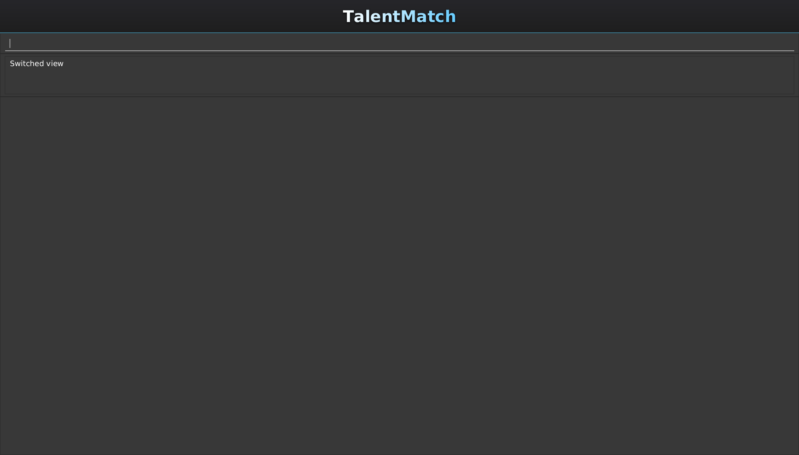

### Exiting the program : `exit`

Exits the program.

Format: `exit`

## Job Commands

--- 

These commands support CRUD operations on Jobs and are only available to you in Job View so that you are able to see real time updates on the GUI.

**Parameters** | **Definition**                                                       | **Constraints**
---------------|----------------------------------------------------------------------|----------------
`JOB_TITLE`    | Name of the job opening                                              | Only alphanumeric characters and spaces allowed, and should not be blank.
`JOB_ROUNDS`   | Number of rounds that an applicant has to complete before receiving an offer | Must be a positive integer between 1 and 10 (inclusive).
`SKILL`       | Skills that are required by the job                                  | Only alphanummeric charcters are allowed, with the exception of `.` and `/`. Skills should only be one word with no spaces.
`INDEX`       | Index of the job in the displayed job list in Job View               | Must be a positive integer and should be an index displayed in Job View.

### Adding a job: `addjob`
Adds a job to TalentMatch

Format: `addjob jt/JOB_TITLE jr/INTERVIEW_ROUNDS [k/SKILL]…​`

<box type="tip" seamless>

**Tip:** A job can have any number of skills (including 0)

</box>

Expected output: 
`addjob jt/Quant Analyst jr/5 k/Maths k/Analytic` adds a job with the specified details

Examples:
* `addjob jt/Software Engineering jr/3 k/React k/JavaScript` adds Software Engineering job with 3 rounds and requires applicants to know React and JavaScript.

### Editing a job: `editjob`

Edits an existing job in TalentMatch.

Format: `editjob INDEX [jt/JOB_TITLE] [jr/JOB_ROUNDS] [k/SKILL]…​`

* Edits the job at the specified `INDEX`. The index refers to the index number shown in the displayed job list. The index **must be a positive integer** 1, 2, 3, …​
* At least one of the optional fields must be provided.
* Existing values will be updated to the input values.
* When editing job skills, the existing skills of the person will be removed i.e adding of skills is not cumulative.
* You can remove all the job's skills by typing `k/` without
  specifying any skills after it.

<box type="warning" seamless>

**Warning:**
Attempting to change `JOB_ROUNDS` to a number less than the application status of any current applicant for that job will result in an error.
</box>

Expected output: 
`editjob 2 jr/5` edits the 2nd job and changes `JOB_ROUNDS` to 5.

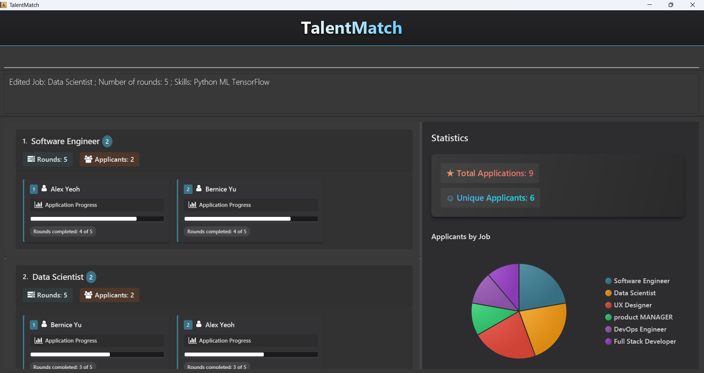

Examples:
*  `editjob 7 jt/Software Engineering jr/3` edits the 7th job and changes its `JOB_TITLE` to Software Engineering and `JOB_ROUNDS` to 3.

### Listing all jobs: `listjob`

Shows a list of all jobs in TalentMatch.

Format: `listjob`

### Locating jobs: `findjob`

Finds jobs whose details contain any of the given keywords.

Format: `findjob KEYWORD [MORE_KEYWORDS]…​`

* The search is case-insensitive. e.g `software` will match `Software`
* The order of the keywords does not matter. e.g. `Engineering Software` will match `Software Engineering`
* Only full words will be matched e.g. `Engi` will not match `Engineer`
* Jobs matching at least one keyword will be returned (i.e. `OR` search).
  e.g. `Engineer` will return `Software Engineer`, `AI Engineer`
* Keywords used in a single `findjob` command searches the displayed list using logical OR.
  e.g. `findjob data engineering` will return `Software Engineering` and `Data Scientist`
* Consecutive `findjob` commands continue the search based on the current displayed list.
  e.g. `findjob data engineering` followed by `findjob engineering` will only return `Software Engineering`
* To reset the displayed list (i.e. when the displayed list is empty or the job you are searching for is no longer in the list), use `listjob` to reset back to original list and continue searching again.

Expected output:
* `findjob data engineer` returns jobs which contain data or engineer in their details. 

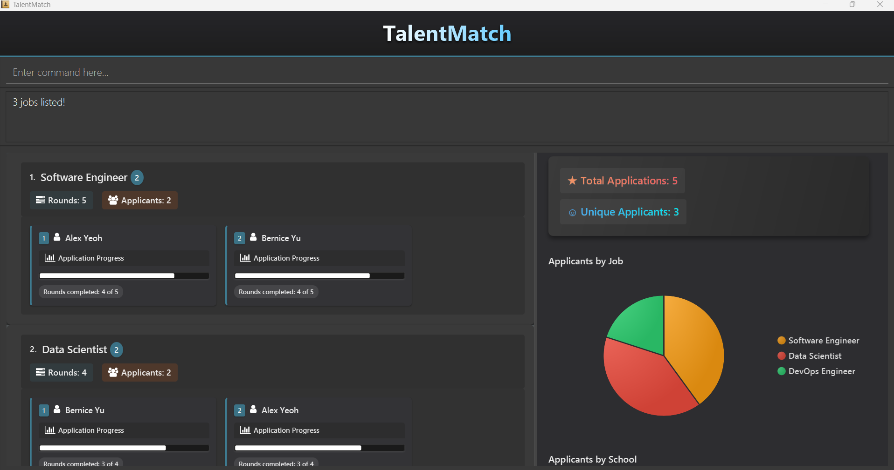

* `findjob data engineer` followed by `findjob software` returns jobs with contains data **or** engineer, **and** software in its details. 

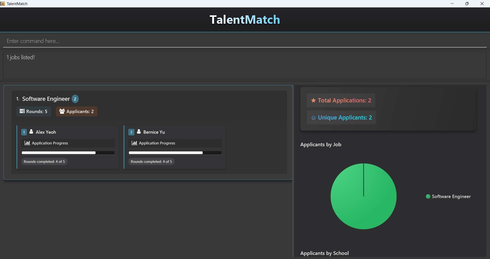

Examples:
* `findjob Software` returns jobs that contain Software in their details.

### Deleting a job: `deljob`

Deletes the specified job from TalentMatch.

Format: `deljob INDEX`

* Deletes the job at the specified `INDEX`.
* The index refers to the index number shown in the displayed job list.
* The index **must be a positive integer** 1, 2, 3, …​

Expected output: 
`deljob 7` deletes the job at the 7th index.

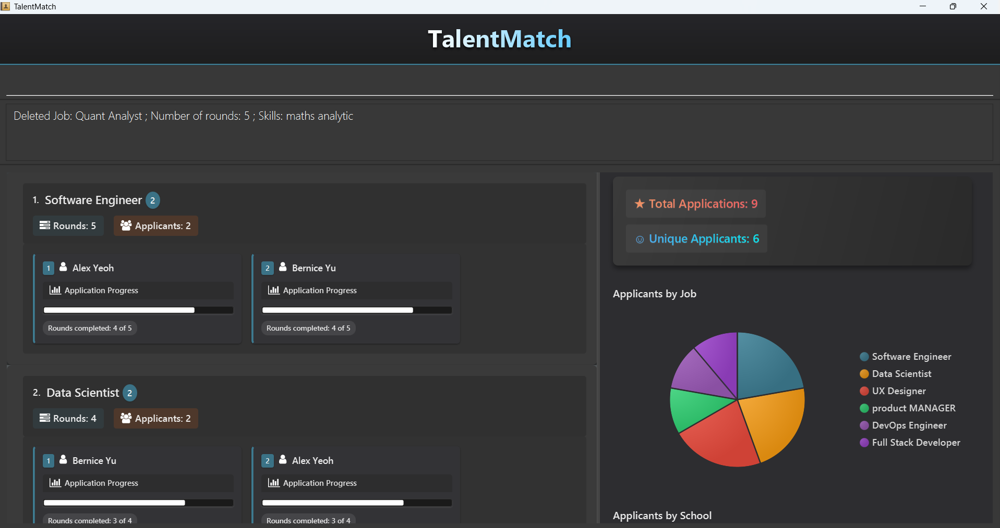

Examples:
* `listjob` followed by `deljob 2` deletes the 2nd job in TalentMatch.
* `findjob Software Engineering` followed by `deljob 1` deletes the 1st job in the results of the `findjob` command.

## Person Commands

---

These commands support CRUD operations on Persons and are only available to you in Person View so that you are able to see real time updates on the GUI.

**Parameters** | **Definition**                                                  | **Constraints**
---------------|-----------------------------------------------------------------|----------------
`NAME`  | Name of the applicant                                           | Only alphanumeric characters and spaces allowed, and should not be blank.
`PHONE_NUMBER`  | Phone number of the applicant                                   | Should be a valid Singapore phone number, and contain only 8 numbers.
`EMAIL`  | Email of the applicant                                          | Emails should be of the format local-part@domain and adhere to the following constraints: 1. The local-part should only contain alphanumeric characters and these special characters, excluding the parentheses, (+_.-). The local-part may not start or end with any special characters. 2. This is followed by a '@' and then a domain name. The domain name is made up of domain labels separated by periods. The domain name must: - end with a domain label at least 2 characters long - have each domain label start and end with alphanumeric characters - have each domain label consist of alphanumeric characters, separated only by hyphens, if any.
`ADDRESS` | Address of the applicant                                        | Contains alphanumeric characters and special characters, and should not be blank.
`SCHOOL` | School that the applicant is currently studying in              | Only alphanumeric characters and spaces allowed, and should not be blank.
`DEGREE` | Degree that the applicant is currently pursuing                 | Only alphanumeric characters and spaces allowed, and should not be blank.
`SKILL` | Skills that the applicant possesses                             | Only alphanummeric charcters are allowed, with the exception of `.` and `/`. Skills should only be one word with no spaces.
`INDEX` | Index of the person in the displayed person list in Person View | Must be a positive integer and should be an index displayed in Person View.

### Adding a person: `add`
Adds a person to TalentMatch.

Format: `add n/NAME s/SCHOOL d/DEGREE p/PHONE_NUMBER e/EMAIL a/ADDRESS [k/SKILL]…​`

<box type="tip" seamless>

**Tip:** A person can have any number of skills (including 0)

</box>

Expected output: 
`add n/John Doe s/NUS d/Computer Science p/98765432 e/johnd@example.com a/John street, block 123, #01-01` adds a person with the specified details.

Examples:
* `add n/John Doe s/NUS d/Computer Science p/98765432 e/johnd@example.com a/John street, block 123, #01-01` adds a person with the specified details without skills.
* `add n/Betsy Crowe s/NTU d/Civil Engineering k/Communication e/betsycrowe@example.com a/Newgate Prison p/1234567 k/Python` adds a person with the specified details with skills.

### Editing a person: `edit`

Edits an existing person in TalentMatch.

Format: `edit INDEX [n/NAME] [s/SCHOOL] [d/DEGREE] [p/PHONE] [e/EMAIL] [a/ADDRESS] [k/SKILL]…​`

* Edits the person at the specified `INDEX`. The index refers to the index number shown in the displayed person list. The index **must be a positive integer** 1, 2, 3, …​
* At least one of the optional fields must be provided.
* Existing values will be updated to the input values.
* When editing skills, the existing skills of the person will be removed i.e adding of skills is not cumulative.
* You can remove all the person's skills by typing `k/` without
  specifying any skills after it.

Expected output: 
`edit 7 k/python` edits the person at the 7th index to have 1 skill.

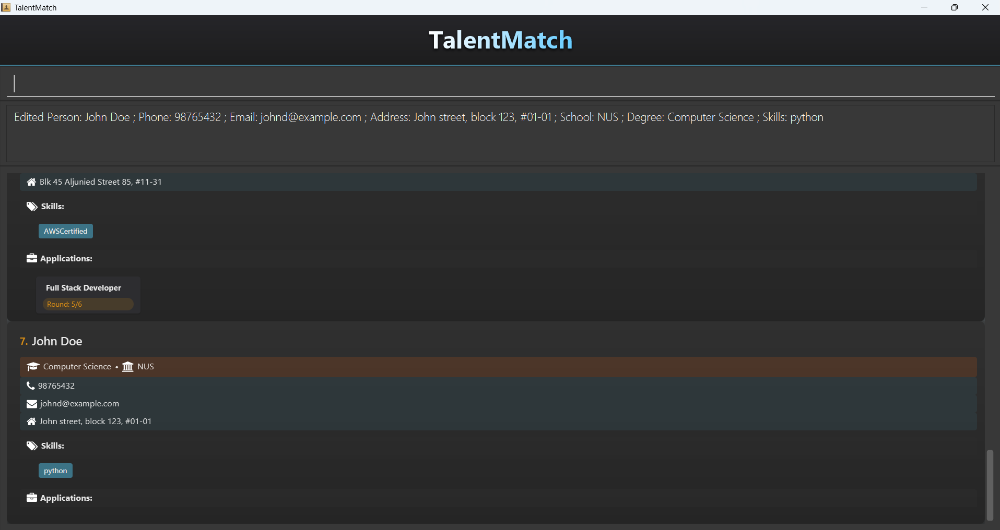

Examples:
*  `edit 1 p/91234567 e/johndoe@example.com` Edits the phone number and email address of the 1st person to be `91234567` and `johndoe@example.com` respectively.
*  `edit 2 n/Betsy Crower k/` Edits the name of the 2nd person to be `Betsy Crower` and clears all existing skills.

#### Listing all persons: `list`

Shows a list of all persons in TalentMatch.

Format: `list`

### Locating persons: `find`

Finds persons whose details contain any of the given keywords.

Format: `find KEYWORD [MORE_KEYWORDS]…​`

* The search is case-insensitive. e.g `hans` will match `Hans`
* The order of the keywords does not matter. e.g. `Hans Bo` will match `Bo Hans`
* Only full words will be matched e.g. `Han` will not match `Hans`
* Persons matching at least one keyword will be returned (i.e. `OR` search).
  e.g. `Hans Bo` will return `Hans Gruber`, `Bo Yang`
* Keywords used in a single `findjob` command searches the displayed list using logical OR.
  e.g. `find Hans Bo` will return `Hans Gruber`, `Bo Yang`
* Consecutive `find` commands continue the search based on the current displayed list.
  e.g. `find Hans Bo` followed by `find Hans` will only return `Hans Gruber`
* To reset the displayed list (i.e. when the displayed list is empty or the person you are searching for is no longer in the list), use `list` to reset back to original list and continue searching again.

Expected output:
* `find alex irfan` returns persons who contain alex **or** irfan in their details

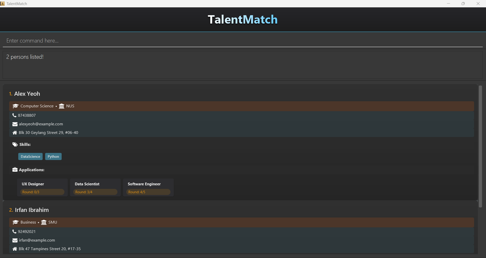

* `find alex irfan` followed by `find yeoh` returns persons who contain alex **or** irfan, **and** yeoh in their details.

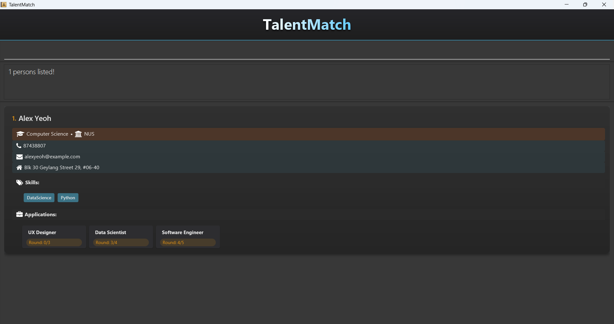

Examples:
* `find John` returns `john` and `John Doe`
* `find alex david` returns `Alex Yeoh`, `David Li`

### Deleting a person: `del`

Deletes the specified person from TalentMatch.

Format: `del INDEX`

* Deletes the person at the specified `INDEX`.
* The index refers to the index number shown in the displayed person list.
* The index **must be a positive integer** 1, 2, 3, …​

Expected output: 
`del 7` deletes the person at the 7th index.

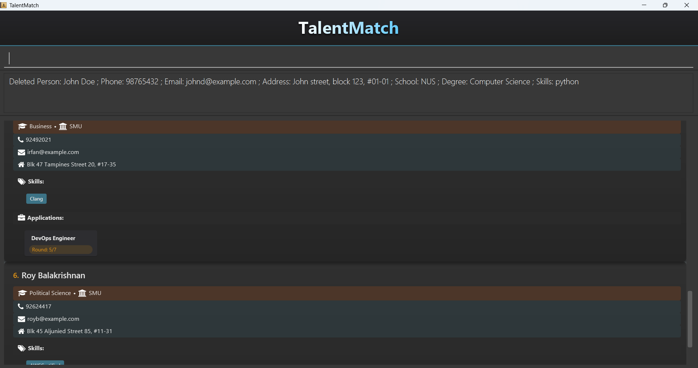

Examples:
* `list` followed by `del 2` deletes the 2nd person in TalentMatch.
* `find Betsy` followed by `del 1` deletes the 1st person in the results of the `find` command.

## Application Commands

---

These commands support CRUD operations on Applications and are only available to you in Job View so that you are able to see real time updates on the GUI.

**Parameters** | **Definition**                                              | **Constraints**
---------------|-------------------------------------------------------------|----------------
`PERSON_INDEX`  | Index of the person in the displayed person list in Person View | Must be a positive integer and should be an index displayed in Person View.
`JOB_INDEX`       | Index of the job in the displayed job list in Job View      | Must be a positive integer and should be an index displayed in Job View.
`APPLICATION_STATUS` | Current round of application process that an applicant is at | Must be a positive integer > 0 and should be less than or equal JOB_ROUNDS of that particular job.
`APPLICATION_INDEX` | Index of the application in the displayed job list in Job View | Must be a positive integer and should be an index displayed in Job View.

Here is a brief label of the various parameters:

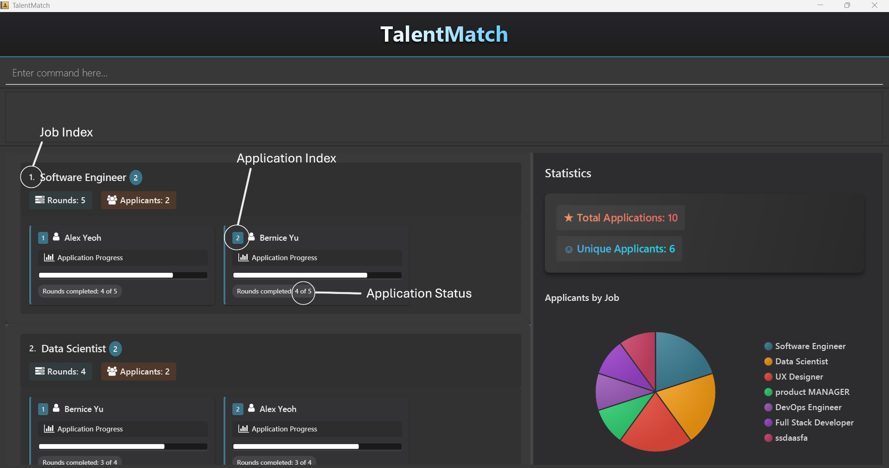

### Adding an application: `addapp`

Adds an application to TalentMatch

Format: `addapp ip/PERSON_INDEX ij/JOB_INDEX`

<box type="tip" seamless>

* All applications start from the 0th round each time (start at 0 of JOB_ROUNDS when added).
* The `PERSON_INDEX` can be obtained by switching to Person View in TalentMatch.
* The `JOB_INDEX` can be obtained by switching to Job View in TalentMatch.
* `addapp` is the only application command that is available to you in both Person and Job view.

</box>

<box type="warning" seamless>

**Warnings:**
* Target person and job should already exist in TalentMatch prior to creation of an application for the target person and job.
* Person and job indices must be valid positive integers existing in the respective views.
  * **Important:** Person and job indices depend on the current state of the displayed list in Person and Job View.
* No existing applications must be present.
  TalentMatch flags duplicate applications for the same applicant and job out with this exception message:
  * `This application already exists in the address book Try using delapp instead!`

</box>

Expected output: 
`addapp ip/1 ij/4` adds an application which has the person at index 1 as the applicant and the job at index 4 as the job that he/she is applying for.

Examples:
* `addap ip/3 ij/6` adds an application for the 3rd person to the 6th job in the current displayed person and job list respectively.

### Locating application: `findapp`

Finds application by `JOB_INDEX` and `APPLICATION_STATUS` in Job View.

Format: `findapp as/APPLICATION_STATUS [ij/JOB_INDEX]`

<box type="tip" seamless>

**Tip:**
* Both the job index and application status can be retrieved from the job view alone.
* Using `APPLICATION_STATUS` on its own returns all applications with the specified `APPLICATION_STATUS`.
* Using `APPLICATION_STATUS` and `JOB_INDEX` returns all applications under the specified job at `JOB_INDEX` with the specified `APPLICATION_STATUS`.
* `findapp` works on the current displayed list of jobs (i.e. if there are multiple jobs with applications with an `APPLICATION_STATUS` of 3 in TalentMatch, but only 1 job is currently displayed on the job list, `findapp as/3` returns only that 1 job).
* Use `listjob` to clear any existing filters to reset the search space to the entire job list.

</box>

<box type="warning" seamless>

**Warnings:**
* `JOB_INDEX` and `APPLICATION_STATUS` must be valid positive integers existing in the respective views.
* **The desired application must already exist in TalentMatch**. TalentMatch cannot find a non-existent application!
* `findjob` can be used alongside `findapp`, however do note that all searches will search the current displayed list.
  * i.e. Suppose job A has 3 applications (2 of which have `APPLICATION_STATUS` of 2), `findapp as/2` returns all applications with `APPLICATION_STATUS` of 2, using `findjob A` after will return job A with only 2 applications shown (despite there existing 3 applications). 

</box>

Expected output: 
`findapp as/2` returns all applications in TalentMatch that currently have `APPLICATION_STATUS` of 2.

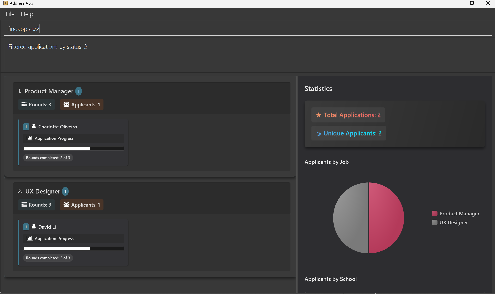

Example:
`findapp as/3 ij/2` returns all applications with `APPLICATION_STATUS` of 3 for the 2nd job in the displayed job list.

### Deleting an application: `delapp`

Deletes the specified application from TalentMatch.

Format: `delapp ij/JOB_INDEX ia/APPLICATION_INDEX`

<box type="tip" seamless>

**Tip:**
Both the job and application indices can be obtained from the job view alone.

</box>

<box type="warning" seamless>

**Warnings:**
* `JOB_INDEX` and `APPLICATION_INDEX` must be valid positive integers existing in Job View.
* A unique existing application must be present.
  TalentMatch flags deleting non-existent applications with this exception message:
    * `This application does not exist in the address book. Try using addapp to add an application first!`

</box>

Expected output: 
`delapp ij/1 ia/1` deletes the 1st application for the 1st job.

Example:
`delapp ij/2 ia/3` deletes the 3rd application for the 2nd job.

### Advancing applications: `advapp`

Advances an application to the next round of interview.

Format: `advapp ij/JOB_INDEX ia/APPLICATION_INDEX`

* All applications are advanced by exactly 1 round each time.
* You should exercise discretion in advancing an application as it signifies that the applicant has not only
gone for the round, but also passed it! Therefore, an applicant who has reached the final round of an application will
be deemed to have received a job offer. Congratulations!
* You should exercise discretion in advancing an application of any applicant who has reached the final round
of another application, as this would otherwise imply the applicant has more than 1 offers for this company!

<box type="warning" seamless>

**Warnings:**
* `JOB_INDEX` and `APPLICATION_INDEX` must be valid positive integers existing in Job View.
* **A unique existing application must be present.**
  TalentMatch flags advancing non-existent applications out with this exception message:
    * `This application does not exist in the address book. Try using addapp to add an application first!`

</box>

Expected output: 
`advapp ij/2 ia/1` advances the 1st application for the 2nd job by one round.

Examples:
* `advapp ij/1 ia/2` advances the 2nd application for the 1st job by one round (if it exists).

### Viewing job details: `viewjob`

Displays a sidebar that shows the job title abd the number of applicants for that job. It also shows the distribution of applicants across different interview rounds in a bar chart, and the skills required for the job.

Format: `viewjob INDEX`

* Shows detailed information of the job at the specified `INDEX`.
* The index refers to the index number shown in the displayed job list.
* The index **must be a natural number** 1, 2, 3, …​

Expected output:
* `viewjob 1` displays information about the 1st job in the sidebar.

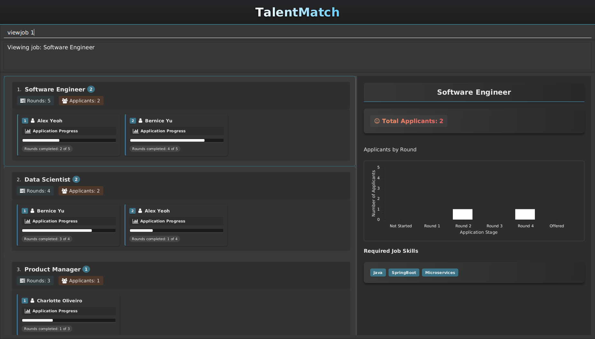

Examples:
* `listjob` followed by `viewjob 2` displays detailed information of the 2nd job in TalentMatch.
* `viewjob 1` shows detailed information about the first job in the current list.
* `viewjob 10` will return a INVALID_INDEX_MESSAGE if there is no job at index 10.
* `viewjob 0` will return a INVALID_COMMAND_MESSAGE as the index must be a natural number.

### Viewing person details from job application: `viewperson`

Shows a sidebar that shows the applicant's name, school, degree, phone number, email, address, and skills. It also shows the application status of the applicant for the job through a progress bar.

Format: `viewperson ij/JOB_INDEX ia/APPLICATION_INDEX`

* Shows detailed information of the person associated with the application at the specified `APPLICATION_INDEX` for the job at the specified `JOB_INDEX`.
* Both indices refer to the index numbers shown in the respective displayed lists.
* Both indices **must be natural numbers** 1, 2, 3, …​

Expected Output:
* `viewperson ia/1 ij/1` displays information about the 1st applicant of the 1st job in the sidebar.

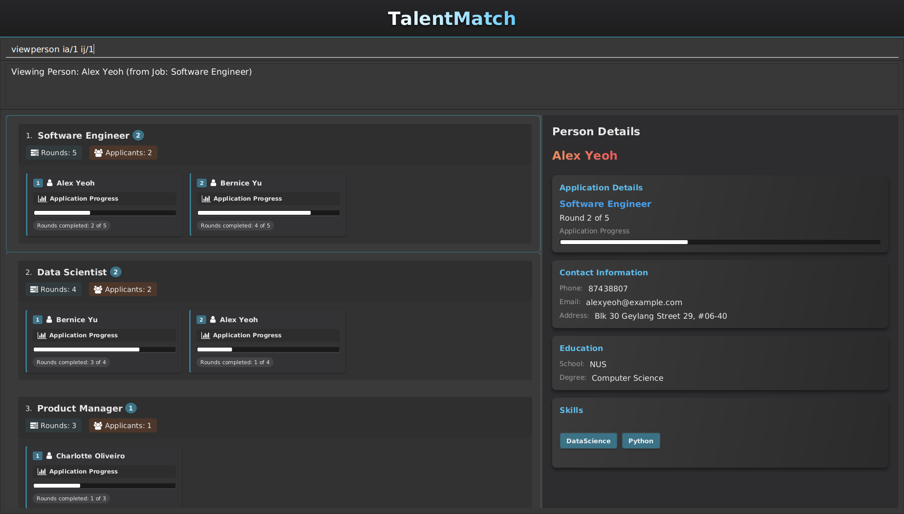

Examples:
* `viewperson ij/1 ia/1` in job view will generate a sidebar with detailed information of the applicant associated with the 1st application for the 1st job (if it exists).
* `viewjob 1` followed by `viewperson ij/1 ia/2` displays detailed information of the applicant associated with the 2nd application for the 1st job.
* `viewperson ij/1 ia/2` will return a NOT_FOUND_MESSAGE if there are no applications at index 2 for the job at index 1.
* `viewperson ij/1 ia/0` will return a INVALID_COMMAND_MESSAGE as the application index must be a natural number.

--- 

### Saving the data

TalentMatch data are saved in the hard disk automatically after any command that changes the data. There is no need to save manually.

### Editing the data file

TalentMatch stores data in two separate JSON files:
* `[JAR file location]/data/addressbook.json` - Contains all person and job data
* `[JAR file location]/data/applicationbook.json` - Contains all application data linking persons to jobs

Advanced users can update data directly by editing these files, but caution is advised.

<box type="warning" seamless>

**Caution:**
If your changes to the data files make their format invalid, TalentMatch will handle it as follows:

1. If you correctly edit the files and maintain valid format:
   * TalentMatch will load your edited data on next startup
   * All relationships between persons, jobs, and applications will be preserved
   * Your changes will be immediately reflected in the UI

2. If the address book file is invalid or missing:
   * TalentMatch will load sample data for both persons/jobs and applications
   * A warning will be logged, but the application will still start

3. If only the applications file is invalid or missing:
   * TalentMatch will keep the existing persons/jobs data
   * It will create a new, empty applications manager
   * This means all links between persons and jobs will be lost

4. If both files are valid but contain inconsistencies:
   * Applications referring to non-existent persons or jobs may cause unexpected behavior

It is strongly recommended to:
* Back up both data files before editing them
* Keep the file format and data consistent across both files
* Restart the application after making direct edits to verify your changes

</box>

--------------------------------------------------------------------------------------------------------------------

## FAQ

**Q**: How do I transfer my data to another Computer? 
**A**: Install the app in the other computer and overwrite the empty data file it creates with the file that contains the data of your previous AddressBook home folder.

**Q**: Why are the commands limited to specific views? 
**A**: We limit commands to their specific views to ensure you are able to see real time updates in the GUI. This is in consideration of the case you type the wrong command and accidentally
change data in the other view unknowingly. 

**Q**: Why are the find commands so restrictive? 
**A**: TalentMatch is built with the assumption that experience users will be unlikely to make typing mistakes when searching for a certain job/person, hence having a find function that continuously
reduces the search space improves your experience by being able to narrow down your displayed lists for easier addition of applications. In the event of typing a wrong keyword, you can use `list`/`listjob` in the 
appropriate view to reset your current search and try searching again.

**Q**: Why are skills limited to 1 word? 
**A**: TalentMatch follows typical resume formats where skills are listed as single words. In the event of skills that take up multiple words, you can compromise by
concatenating them into a single word.

--------------------------------------------------------------------------------------------------------------------

## Known issues

### UI Issues
1. **Multiple Window Usage:** When using multiple screens, if you move the application to a secondary screen, and later switch to using only the primary screen, the GUI will open off-screen. The remedy is to delete the `preferences.json` file created by the application before running the application again.
2. **Minimising the Help Window:** If you minimize the Help Window and then run the `help` command again, the original Help Window will remain minimized, and no new Help Window will appear. The remedy is to manually restore the minimized Help Window.
3. **Text Truncation in Display:** Long text entries may be truncated with "..." when the application window isn't wide enough. You may not be able to see the complete information for some fields.
4. **Viewport Issues:** Parts of the application may be cut off at smaller window sizes, including the default size at first startup. We have included a minimum viewport size for most devices, however in the case where your device is unable to support this viewport, then you may run into unexpected UI issues as mentioned before.
5. **Oversized Messages:** Some success and error messages may be too long to read easily in the current application.

### Data Storage Issues
6. **Storage File Synchronization:** The application generates two storage files: applicationsmanager.json and addressbook.json. Both files contain information related to persons and jobs. If you make changes to persons or jobs in one file, you MUST replicate these changes in the other file. Failure to synchronize these files will result in data mismatches when the application loads, leading to undefined application behavior.
7. **Command Syntax Sensitivity:** Any non-adherence to the case sensitivity and input validation rules given in the command descriptions may cause unexpected errors. You should read through and follow these case sensitivity and input validation rules carefully.
8. **Multiple Instance Conflict:** Running multiple instances of the application simultaneously can corrupt your data files. You should only run one instance of TalentMatch at a time. Close any existing instance before opening a new one.
9. **Skill Storage Limitation:** Adding skills that are more than 1 word long will result in an error. You can concatenate the skill into a single word before adding them as a compromise.

--------------------------------------------------------------------------------------------------------------------

## Command summary

Action     | Format, Examples
-----------|----------------------------------------------------------------------------------------------------------------------------------------------------------------------
**Add**    | `add n/NAME s/SCHOOL d/DEGREE p/PHONE_NUMBER e/EMAIL a/ADDRESS [k/SKILL]…​`   e.g., `add n/James Ho s/NUS d/Physics p/22224444 e/jamesho@example.com a/123, Clementi Rd, 1234665 k/python k/java`
**AddJob** | `addjob jt/JOB_TITLE jr/INTERVIEW_ROUNDS [k/SKILL]…​`   e.g., `addjob jt/Software Engineering jr/3 k/Python`
**AddApp** | `addapp ip/PERSON_INDEX ij/JOB_INDEX `   e.g., `addapp ip/1 ij/1`
**AdvApp** | `advapp ij/JOB_INDEX ia/APPLICATION_INDEX `   e.g., `adv ij/1 ia/1`
**Clear**  | `clear`
**Delete** | `del INDEX`  e.g., `del 3`
**DeleteJob** | `deljob INDEX`   e.g., `deljob 3`
**DeleteApp** | `delapp ij/JOB_INDEX ia/APPLICATION_INDEX `   e.g., `delapp ij/1 ia/1`
**Edit**   | `edit INDEX [n/NAME] [s/SCHOOL] [d/DEGREE] [p/PHONE_NUMBER] [e/EMAIL] [a/ADDRESS] [k/SKILL]…​`  e.g.,`edit 2 n/James Lee e/jameslee@example.com`
**EditJob** | `editjob INDEX [jt/JOB_TITLE] [jr/INTERVIEW_ROUNDS] [k/SKILL]…​`   e.g., `editjob 7 jt/Software Engineering jr/3`
**Find**   | `find KEYWORD [MORE_KEYWORDS]…​`  e.g., `find James Jake`
**FindJob** | `findjob KEYWORD [MORE_KEYWORDS]…​`  e.g., `findjob Software Engineering`
**FindApp** | `findapp ia/APPLICATION_STATUS [ij/JOB_INDEX]`   e.g., `findapp ia/2 ij/1`
**Help**   | `help`
**List**   | `list`
**ListJobs** | `listjob`
**Switch** | `switch`
**ViewJob** | `viewjob INDEX`   e.g., `viewjob 3`
**ViewPerson** | `viewperson ij/JOB_INDEX ia/APPLICATION_INDEX`   e.g., `viewperson ij/1 ia/2`
